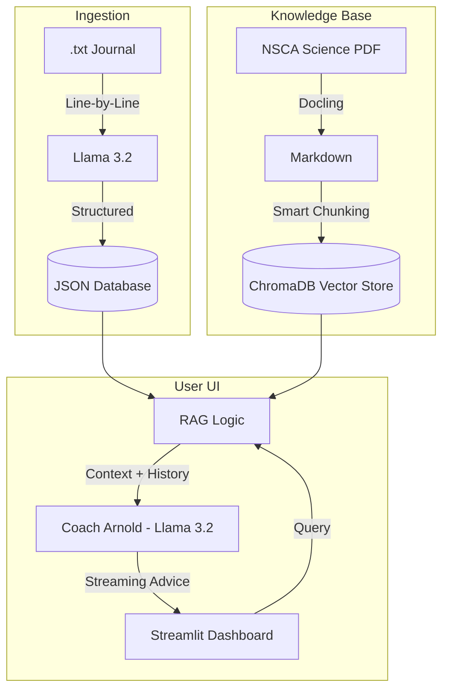

# 🏋️‍♂️ Elite AI Fitness Tracker & RAG Coach

> **Privacy-First Local AI:** Designed for local execution on NVIDIA RTX Hardware to ensure sensitive health data remains 100% private and secure.

A local-AI fitness dashboard that transforms messy workout journals into structured analytics and provides a science-backed "AI Coach" using RAG (Retrieval-Augmented Generation).

## 🚀 The Technical Challenge
Workout data is notoriously messy. Converting human shorthand (e.g., "70s for 3x10") into a database often results in "Lazy AI" errors where models summarize or skip entries. This project implements a **Brute-Force Ingestion Pipeline** and a **Multi-Model RAG Stack** to solve these challenges with 100% data fidelity.

## 🏗 System Architecture

## 🛠 Tech Stack
- **Languages:** Python (Pandas, Re, Asyncio)
- **AI Models:** Llama 3.2 (Extraction & Coaching), Qwen 3.5 (Reasoning)
- **Inference Engine:** Ollama (Local GPU acceleration via RTX 5070)
- **PDF Processing:** Docling (IBM’s Layout-Aware Parser)
- **Vector Database:** ChromaDB
- **Framework:** Streamlit

## 🌟 Key Features
- **100% Reliable Ingestion:** Uses a custom brute-force line-by-line parsing strategy to ensure no workout is skipped.
- **Science-Backed Advice:** The "AI Coach" retrieves actual training principles from a 100-page NSCA manual before answering.
- **Interactive Performance Matrix:** A dynamic UI that tracks volume, max weight, and highlights "PR" (Personal Records) using sentiment analysis.
- **Privacy First:** 100% local. No data ever leaves your hardware.

## 📊 Performance Metrics & Optimization
To achieve a production-ready experience on local hardware, several architectural trade-offs were made regarding latency vs. accuracy.

| Process | Model | Hardware | Speed/Latency |
| :--- | :--- | :--- | :--- |
| **Data Ingestion** | Llama 3.2 (3B) | RTX 5070 | ~1.2s per workout line |
| **PDF Extraction** | Docling (Layout Model) | RTX 5070 | ~4.5s per page (105 pages) |
| **Vector Embedding** | all-MiniLM-L6-v2 | RTX 5070 | < 50ms per chunk |
| **RAG Coaching** | Llama 3.2 (3B) | RTX 5070 | ~30ms per token (Streaming) |

### **Key Technical Trade-offs**
- **Model Selection:** Swapped Qwen 2.5/3.5 (Reasoning) for Llama 3.2 (Fast) in the Coaching module. While Qwen provided deeper reasoning, the **30-second "Thinking" latency** was unacceptable for a real-time UI.
- **Brute-Force Ingestion:** Moved from "Batch" processing to "Line-by-Line" extraction. This increased total ingestion time by 15% but improved **data fidelity from ~80% to 100%**.
- **Memory Management:** Implemented `@st.cache_resource` for the Vector DB and Embedding models, reducing subsequent query response times by **90%** (eliminating model reload overhead).

## 🛠 Installation
1. Install [Ollama](https://ollama.com) and pull models: `ollama pull llama3.2`
2. Clone this repo.
3. Place your training manuals (PDF) into the knowledge_base/ folder.
4. Install dependencies: `pip install -r requirements.txt`
5. Run ingestion: `python ingest_data.py`
6. Launch UI: `streamlit run main_app.py`