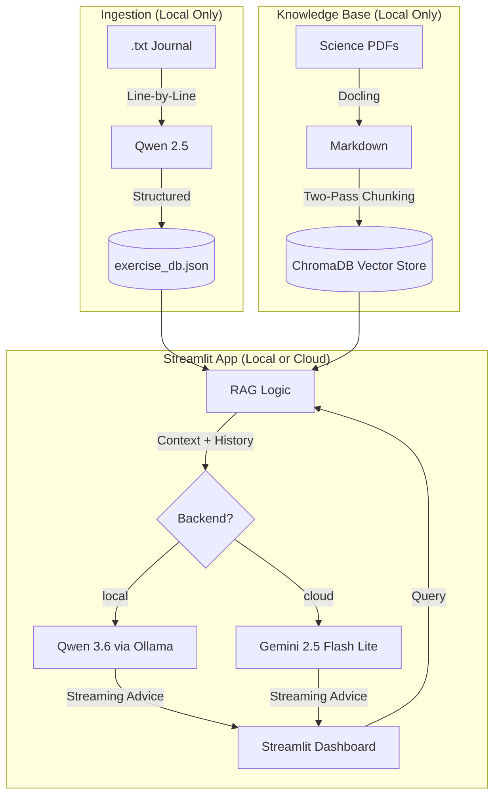

# 🏋️‍♂️ Elite AI Fitness Tracker & RAG Coach

> **Local-first, cloud-ready:** Runs entirely on local NVIDIA RTX hardware for maximum privacy, with optional Gemini cloud backend for public Streamlit deployment.

A fitness dashboard that transforms messy workout journals into structured analytics and provides a science-backed "AI Coach" using RAG (Retrieval-Augmented Generation).


## 🚀 The Technical Challenge
Workout data is notoriously messy. Converting human shorthand (e.g., "70s for 3x10") into a database often results in "Lazy AI" errors where models summarize or skip entries. This project implements a **Brute-Force Ingestion Pipeline** and a **Multi-Model RAG Stack** to solve these challenges with 100% data fidelity.

## 🏗 System Architecture



## 🛠 Tech Stack
- **Languages:** Python (Pandas, Re, Datetime)
- **AI Models:** Qwen 2.5 (data extraction · local only), gemma4:26b (coaching · local), Gemini 2.5 Flash Lite (coaching · cloud)
- **Inference Engine:** Ollama (local GPU via RTX 5070) · Google AI API (cloud)
- **PDF Processing:** Docling (IBM's Layout-Aware Parser)
- **Vector Database:** ChromaDB with LangChain
- **Framework:** Streamlit

## 🌟 Key Features
- **Dual-Backend Coaching:** Coach GT runs on gemma4:26b locally (via Ollama) or Gemini 2.5 Flash Lite in the cloud. Switch with a single line in `secrets.toml` — no code changes needed.
- **Password-Protected UI:** App is secured via a password gate backed by Streamlit Secrets — safe for public deployment.
- **100% Reliable Ingestion:** Uses a custom brute-force line-by-line parsing strategy to ensure no workout entry is skipped. Dates, session types, and exercise data are all captured and structured.
- **Log Workouts from the UI:** New workout days can be entered directly in the app in natural shorthand. Entries are parsed by Qwen 2.5, then written to both `my_messy_workouts.txt` and `exercise_db.json` automatically.
- **Science-Backed Advice:** Coach GT retrieves relevant chunks from a library of open-access research articles and training manuals before answering. Citations reference article titles — never invented filenames or chunk numbers.
- **Interactive Workout History:** A session-by-session calendar view shows the last 20 workouts. Each day is expandable to show a full exercise table with metrics and progressive overload status per exercise.
- **Progressive Overload Tracking:** Automatically detects when weight has stagnated across 3+ sessions and surfaces a warning in the UI and in the coach's context.
- **Full Chat Memory:** Coach GT maintains the full conversation history within a session, allowing follow-up questions and contextual coaching across multiple exchanges.
- **Privacy First:** Ingestion and vector DB pipelines run 100% locally. No workout data is sent externally unless the cloud coaching backend is enabled.

## 📊 Performance Metrics & Optimization

| Process | Model                  | Hardware | Speed / Latency |
| :--- |:-----------------------| :--- | :--- |
| **Data Ingestion** | Qwen 2.5               | RTX 5070 | ~1.2s per workout line |
| **PDF Extraction** | Docling (Layout Model) | RTX 5070 | ~4.5s per page |
| **Vector Embedding** | all-MiniLM-L6-v2       | RTX 5070 | < 50ms per chunk |
| **RAG Coaching (local)** | gemma4:26b via Ollama  | RTX 5070 | ~30ms per token (streaming) |
| **RAG Coaching (cloud)** | Gemini 2.5 Flash Lite  | Google API | ~20ms per token (streaming) |

### **Key Technical Trade-offs**
- **Dual-Backend Coach:** Ingestion stays local (Qwen 2.5) since it runs as a one-time pipeline step before deployment. The coach is the only live inference call in the app, so it's the only component that needs a cloud API path for hosted deployment.
- **Two-Pass Chunking:** `MarkdownHeaderTextSplitter` preserves header context in each chunk; `RecursiveCharacterTextSplitter` caps oversized sections at 1000 characters. This prevents single giant chunks from overwhelming retrieval on sections with no sub-headers.
- **Dedup Protection:** `build_vector_db.py` wipes and fully rebuilds ChromaDB on every run, preventing duplicate chunks from accumulating across re-runs.
- **Brute-Force Ingestion:** Line-by-line extraction (vs. batch) increased ingestion time by ~15% but improved **data fidelity from ~80% to 100%**.
- **Memory Management:** `@st.cache_resource` on the Vector DB and embedding model eliminates reload overhead, reducing subsequent query latency by **~90%**.
- **Smart RAG Context:** Coach GT receives the full chronological workout log + a per-exercise summary on every query. The selected day in the UI is passed as a reference point, not a filter — the coach always has the complete history.

## 🗂 Project Structure

```
gym-rag-app/
├── knowledge_base/          # Source PDFs (research articles, training manuals)
├── data/
│   ├── raw/
│   │   └── my_messy_workouts.txt   # Source workout journal
│   ├── processed/
│   │   └── exercise_db.json        # Structured exercise database
│   ├── knowledge_markdown/         # Docling PDF → Markdown output
│   └── chroma_db/                  # ChromaDB vector store
├── .streamlit/
│   └── secrets.toml                # Local secrets config (do NOT commit)
├── ingest_knowledge.py     # Step 1: Convert PDFs → Markdown
├── build_vector_db.py      # Step 2: Chunk Markdown → ChromaDB
├── ingest_data.py          # Step 3: Parse workout .txt → exercise_db.json
├── main_app.py             # Streamlit app
├── test_search.py          # Verify ChromaDB retrieval quality
└── requirements.txt
```

## 🛠 Installation

1. Install [Ollama](https://ollama.com) and pull the required local models:
   ```bash
   ollama pull qwen2.5
   ollama pull gemma4:26b
   ```
2. Clone this repo.
3. Place your science PDFs and training manuals into the `knowledge_base/` folder.
4. Install dependencies:
   ```bash
   pip install -r requirements.txt
   ```
5. Create `.streamlit/secrets.toml` and configure your backend:
   ```toml
   APP_PASSWORD = "your_password_here"

   # "local" = Ollama/gemma4:26b | "cloud" = Gemini 2.5 Flash Lite
   COACH_BACKEND = "local"

   # Required only when COACH_BACKEND = "cloud"
   # Get your key at: https://aistudio.google.com/apikey
   GEMINI_API_KEY = "your_gemini_api_key_here"
   ```
6. Run the ingestion pipeline in order:
   ```bash
   python ingest_knowledge.py   # Convert PDFs to Markdown
   python build_vector_db.py    # Build the vector store
   python ingest_data.py        # Parse your workout journal
   ```
7. Launch the app:
   ```bash
   streamlit run main_app.py
   ```

## ☁️ Streamlit Cloud Deployment
1. Push your repo to GitHub. Ensure `.streamlit/secrets.toml` is listed in `.gitignore`.
2. Connect your repo in the [Streamlit Cloud dashboard](https://streamlit.io/cloud).
3. Go to **App Settings → Secrets** and add:
   ```toml
   APP_PASSWORD = "your_password_here"
   COACH_BACKEND = "cloud"
   GEMINI_API_KEY = "your_gemini_api_key_here"
   ```
4. Deploy. The app will use Gemini automatically — no code changes required.

> **Note on data files:** `exercise_db.json` and `chroma_db/` are generated locally and must be committed to the repo (or hosted separately) for the cloud app to have access to your workout history and science knowledge base. Ensure sensitive workout data is acceptable to store in your repository, or use a private repo.
